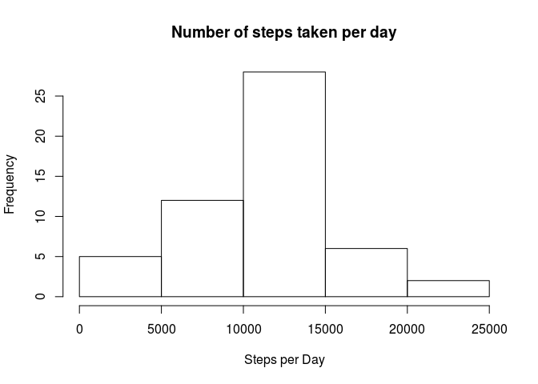
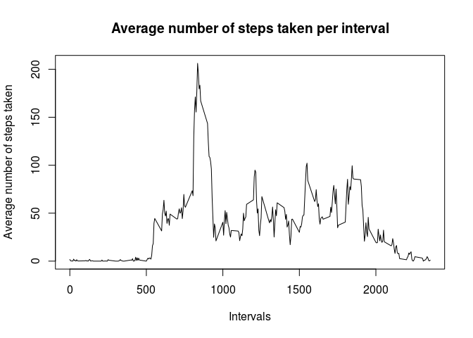
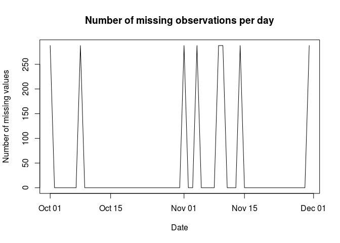
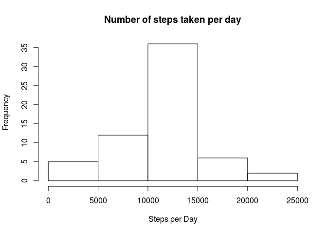
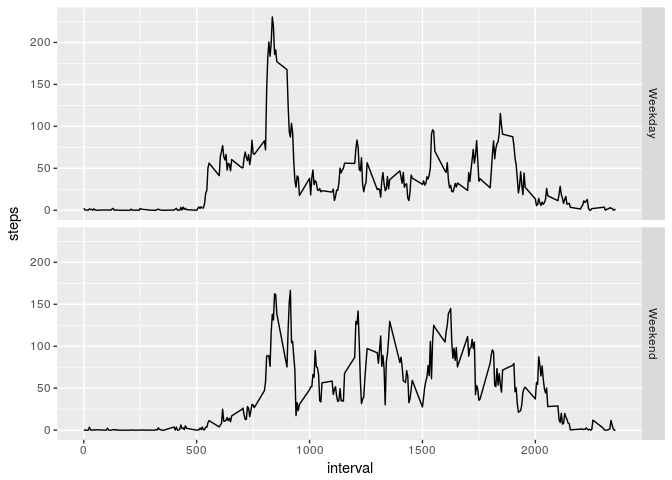

# PA1_template
Suhail Wali  
31 August 2017  


# Activity data analysis

This report is part of an assignment for the [Coursera.org](http://www.coursera.org/) Data Science Specialization - Reproducible research course (Week2). As part of this assignment we will make use of data from a personal activity monitoring device. This device collects data at 5 minute intervals through out the day. The data consists of two months of data from an anonymous individual collected during the months of October and November, 2012 and include the number of steps taken in 5 minute intervals each day. We will analyse the data and produce some insights from it.

Let's read the data and have a brief look at it. Also, load the required libraries.

```r
library(dplyr)
library(ggplot2)
library(lubridate)

activity <- read.csv("activity.csv",stringsAsFactors = FALSE)
str(activity)
```

```
## 'data.frame':	17568 obs. of  3 variables:
##  $ steps   : int  NA NA NA NA NA NA NA NA NA NA ...
##  $ date    : chr  "2012-10-01" "2012-10-01" "2012-10-01" "2012-10-01" ...
##  $ interval: int  0 5 10 15 20 25 30 35 40 45 ...
```

We see that the data has 17568 observations and 3 variables. We also see that the steps variables can have missing values. The date is coded as a character variable. We will first convert date variable to date class.

```r
activity$date <- as.Date(activity$date,'%Y-%m-%d')
class(activity$date)
```

```
## [1] "Date"
```

Let's generate some insights from the data.

## What is mean total number of steps taken per day?
Let's build a dataframe summarized by each day.

```r
steps_perday <- activity %>%
             group_by(date) %>%
             summarise(steps = sum(steps)) %>%
             arrange(date)
```
Let's plot a histogram of the number of steps taken per day:

```r
hist(steps_perday$steps, main="Number of steps taken per day",xlab="Steps per Day")
```

<!-- -->

The mean number of steps taken per day are 1.0766189\times 10^{4} and the median steps taken per day are 10765.

##What is the average daily activity pattern?
Let's build a data frame summarized by each 5 minute interval.

```r
steps_perinterval <- activity %>%
             group_by(interval) %>%
             summarise(steps = mean(steps,na.rm=TRUE)) %>%
             arrange(interval)
```
Let's plot a time-series plot of the average number of steps taken per interval:

```r
with(steps_perinterval, plot(interval,steps, type="l",main="Average number of steps taken per interval",xlab="Intervals",ylab="Average number of steps taken"))
```

<!-- -->

The 5-minute interval with the highest average number of steps across all days is interval 835.

## Imputing missing values
Let's see how many missing values we have in our data. Let's plot the number of missing values per day.

```r
missing_data <- activity %>%
  group_by(date) %>%
  summarise(missing = sum(is.na(steps))) %>%
  arrange(date)

with(missing_data, plot(date,missing, type="l",main="Number of missing observations per day",xlab="Date",ylab="Number of missing values"))
```

<!-- -->

We see from the plot that there are quite a few days with missing observations. We will impute these missing observations with a mean of the steps across the interval. We'll then plot a histogram of number of steps.

```r
steps_perinterval.impute <- activity %>%
  group_by(interval) %>%
  mutate(steps= ifelse(is.na(steps), round(mean(steps, na.rm=TRUE),0), steps)) %>%
  arrange(date, interval)

steps_perday.impute <- steps_perinterval.impute %>%
  group_by(date) %>%
  summarise(steps = sum(steps)) %>%
  arrange(date)

hist(steps_perday.impute$steps, main="Number of steps taken per day",xlab="Steps per Day")
```

<!-- -->

The mean number of steps taken per day(with missing values imputed) are 1.0765639\times 10^{4} and the median steps taken per day are 1.0762\times 10^{4}.

We can clearly see that imputing the missing values hasn't had much of an impact on the mean and median number of steps. 

## Are there differences in activity patterns between weekdays and weekends?
Let's see if the activity patterns differs on weekends compared to weekdays for 5-minute intervals. We'll first create a factor variable to distinguish weekdays from weekends.

```r
steps_perinterval_daytype <- steps_perinterval.impute %>%
   mutate(daytype = ifelse(wday(date) %in% c(1,7), "Weekend", "Weekday")) %>%
     group_by(interval,daytype) %>%
     summarise(steps = mean(steps,na.rm=TRUE)) %>%
    arrange(interval,daytype)
```

Let's plot a line plot of the number of steps taken per 5-minute interval split by whether it's a weekday or a weekend.

```r
ggplot(steps_perinterval_daytype,aes(interval,steps)) + geom_line() + facet_grid(daytype ~ .)
```

<!-- -->

The line plots tend to indicate that there is higher activity on the weekends.
